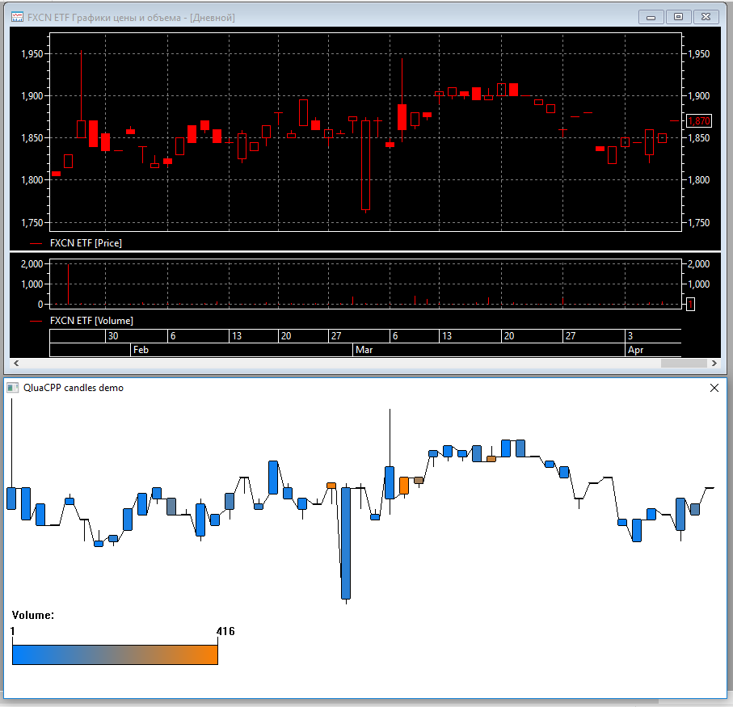

You are looking at tutorial page for QluaCpp library in Russian. For English, see [README_en.md](README_en.md).

## Обучающие примеры для библиотеки QluaCpp ##

[**QluaCpp**](https://github.com/elelel/qluacpp) - библиотека для написания плагинов на C++ для торгового терминала **Quik**

### Как скомпилировать код ###
Склонируйте репозитарий, не забыв рекурсивно получить **все подмодули**.
Запустите CMake, чтоб сгенерировать проект из директории каждого примера. 
Код проверялся только на компиляторе Microsoft.

### Примеры ###

Внутри каждой директории примеров находится более подробное описание в индивидуальном README.md

 - [Базовый](basic_tutorial) пример. Подробно пошагово описывает, как поднять среду разработки и скомпилировать простейший пример, который выводит информационные сообщения в терминале:
 
 
 
 - [Пример 1 из qlua.chm](qlua_chm_ex1). Пример из приложения 1 оригинального файла помощи qlua, портированный на QluaCpp. Заполняет таблицу строками с текущим временем и тестовыми данными в разном формате.
 
 

 - [Угроза падения цены из-за дивидендов](dividend_threat). Простой плагин, который скачивает из Интернета данные по закрытию реестров и дивидендной доходности, после чего показывает таблицу в терминале Quik, добавляя красный оттенок фона пропорционально уровню "угрозы":

 

- [Сохранение обезличенных сделок в файл](log_all_trades). Плагин асинхронно в отдельном потоке записывает информацию о сделках из таблицы обезличенных сделок в текстовой файл:

```
Event at Thu May 25 03:59:49 2017, written at Thu May 25 03:59:49 2017. All classes. Class codes: EQOB, PSAU, PSSU, AUCT, AUCT_BND, SMAL, EQDB, EQQI, TQBR, TQOB, TQQI, TQDE, INDX, RTSIDX, FRGNIDX, TQIF, TQTF, REPORT, ALGO_ICEBERG, ALGO_VOLATIL, ALGO_GTD, TQTC, EQRP, PSRP, TQOD
Event at Thu May 25 03:59:49 2017, written at Thu May 25 03:59:49 2017. Class info. Name: А1-Облигации, Code: EQOB, Number of parameters: 64, Number of securities: 1239
Event at Thu May 25 03:59:49 2017, written at Thu May 25 03:59:49 2017. Class info. Name: РПС: ММВБ ФБ: Первичное размещение (облигации), Code: PSAU, Number of parameters: 64, Number of securities: 23
Event at Thu May 25 03:59:49 2017, written at Thu May 25 03:59:49 2017. Class info. Name: РПС: ММВБ ФБ: Первичное размещение (акции), Code: PSSU, Number of parameters: 64, Number of securities: 0
...
Event at Thu May 25 04:02:39 2017, written at Thu May 25 04:02:49 2017. All trades. Name: Таганрогский комб.завод ОАО ао, Code: TGKO, Price: 0.185, Value: 1.85, Qty: 1
Event at Thu May 25 04:02:40 2017, written at Thu May 25 04:02:49 2017. All trades. Name: Таганрогский комб.завод ОАО ао, Code: TGKO, Price: 0.185, Value: 1.85, Qty: 1
Event at Thu May 25 04:02:40 2017, written at Thu May 25 04:02:49 2017. All trades. Name: Таганрогский комб.завод ОАО ао, Code: TGKO, Price: 0.185, Value: 1.85, Qty: 1
Event at Thu May 25 04:02:41 2017, written at Thu May 25 04:02:49 2017. All trades. Name: Таганрогский комб.завод ОАО ао, Code: TGKO, Price: 0.185, Value: 1.85, Qty: 1
Event at Thu May 25 04:02:41 2017, written at Thu May 25 04:02:49 2017. All trades. Name: Таганрогский комб.завод ОАО ао, Code: TGKO, Price: 0.185, Value: 1.85, Qty: 1
Event at Thu May 25 04:02:42 2017, written at Thu May 25 04:02:49 2017. All trades. Name: Таганрогский комб.завод ОАО ао, Code: TGKO, Price: 0.185, Value: 1.85, Qty: 1
Event at Thu May 25 04:02:43 2017, written at Thu May 25 04:02:49 2017. All trades. Name: Таганрогский комб.завод ОАО ао, Code: TGKO, Price: 0.185, Value: 1.85, Qty: 1
Event at Thu May 25 04:02:43 2017, written at Thu May 25 04:02:49 2017. All trades. Name: Медиахолдинг (ПАО) ао, Code: ODVA, Price: 0.192, Value: 192, Qty: 1
Event at Thu May 25 04:02:43 2017, written at Thu May 25 04:02:49 2017. All trades. Name: Таганрогский комб.завод ОАО ао, Code: TGKO, Price: 0.185, Value: 1.85, Qty: 1
Event at Thu May 25 04:02:43 2017, written at Thu May 25 04:02:49 2017. All trades. Name: Таганрогский комб.завод ОАО ао, Code: TGKO, Price: 0.185, Value: 1.85, Qty: 1
Event at Thu May 25 04:02:44 2017, written at Thu May 25 04:02:49 2017. All trades. Name: Таганрогский комб.завод ОАО ао, Code: TGKO, Price: 0.185, Value: 1.85, Qty: 1
```

- [Получение информации и отрисовка свечей графика из кеша Quik](draw_candles). Плагин получает закешированную информацию по последним свечам графика и затем отрисовывает их в собственном окне по собственным правилам.



- [Получение информации и отрисовка свечей графика в реальном времени по коллбеку](draw_candles_rt). Отрисовывает свечи в реальном времене по мере  поступления иформации о них по коллбеку

