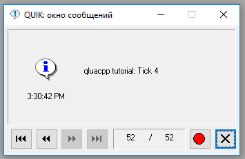
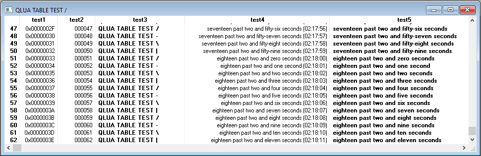
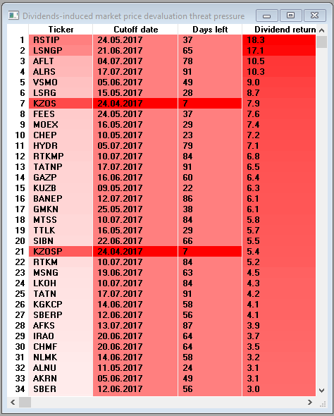

You are looking at tutorial page for QluaCpp library in Russian. For English, see [README_en.md](README_en.md).

## Обучающие примеры для библиотеки QluaCpp ##

[**QluaCpp**](https://github.com/elelel/qluacpp) - библиотека для написания плагинов на C++ для торгового терминала **Quik**

### Как скомпилировать код ###
Склонируйте репозитарий, не забыв рекурсивно получить **все подмодули**.
Запустите CMake, чтоб сгенерировать проект из директории каждого примера. 
Код проверялся только на компиляторе Microsoft.

### Примеры ###

Внутри каждой директории примеров находится более подробное описание в индивидуальном README.md

 - [Базовый](basic_tutorial) пример. Подробно пошагово описывает, как поднять среду разработки и скомпилировать простейший пример, который выводит информационные сообщения в терминале:
 
 
 
 - [Пример 1 из qlua.chm](qlua_chm_ex1). Пример из приложения 1 оригинального файла помощи qlua, портированный на QluaCpp. Заполняет таблицу строками с текущим временем и тестовыми данными в разном формате.
 
 

 - [Угроза падения цены из-за дивидендов](dividend_threat). Простой плагин, который скачивает из Интернета данные по закрытию реестров и дивидендной доходности, после чего показывает таблицу в терминале Quik, добавляя красный оттенок фона пропорционально уровню "угрозы":

 

- [Сохранение обезличенных сделок в файл](log_all_trades). Плагин асинхронно в отдельном потоке записывает информацию о сделках из таблицы обезличенных сделок в текстовой файл:

```
Event time	Time written	SecCode	Price	Value	Qty
Tue Apr 18 03:35:46 2017	Tue Apr 18 03:35:46 2017	GAZP	123.01	246020	200
Tue Apr 18 03:35:46 2017	Tue Apr 18 03:35:46 2017	GAZP	123.01	139001	113
Tue Apr 18 03:35:46 2017	Tue Apr 18 03:35:46 2017	GAZP	123	3690	3
Tue Apr 18 03:35:46 2017	Tue Apr 18 03:35:46 2017	ALRS	88.11	8811	1
Tue Apr 18 03:35:46 2017	Tue Apr 18 03:35:46 2017	GAZP	123	67650	55
```


