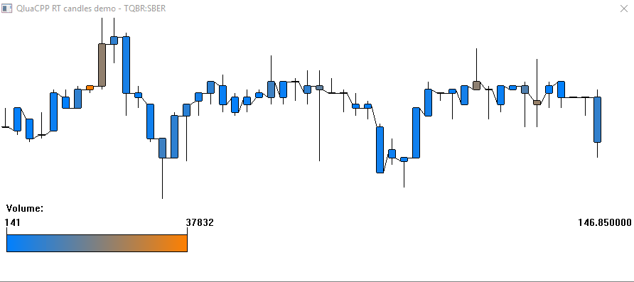

# Получение информации и отрисовка свечей графика из кеша Quik #
Плагин получает информацию о свечах по коллбеку и затем отрисовывает их в собственном окне по собственным правилам.

## Цель примера и приобретаемые навыки ##
 * Работа с получением данных графиков Quik в режиме реального времени при помощи функций CreateDataSource, SetUpdateCallback
 * Отображение собственного окна внутри Quik с отрисовкой изображения
 * Синхронизация потоков
 
 
