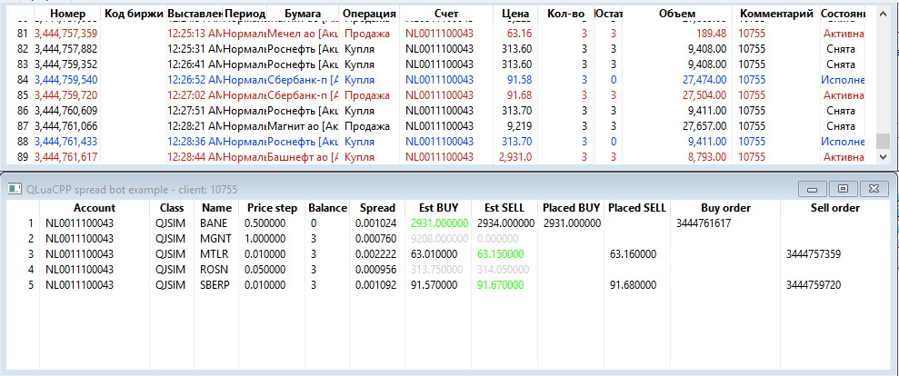

# Спредовый робот

 

- Периодически сканирует рынок и отбирает N инструментов с лучшим спредом предложения/цены
- Подписывается на стакан котировок лучших по спреду инструментов, отписывается от стакана котировок, где спред стал ниже порога
- Вычисляет оптимальную позицию с учетом отступа по существующим предложениям нарастающим итогом
- Выставляет заявки в случае выгодного спреда в две стороны ("по-маркетмейкеровски"), снимает заявки по мере необходимости
- Имеет начальную защиту от "загонщиков стаканных ботов" (перестает ставить заявки на покупку при слишком высокой частоте)
- Ведет отдельный учет "своих" инструментов, чтоб не мешать одновременной работе с данного счета пользователя или других ботов

Внимание! Робот написан в целях демонстрации возможностей QLuaCPP и не предназначен для торговли "живыми" деньгами!

Основной функционал реализован, но нуждается в доработке трейдинговой стратегии.
